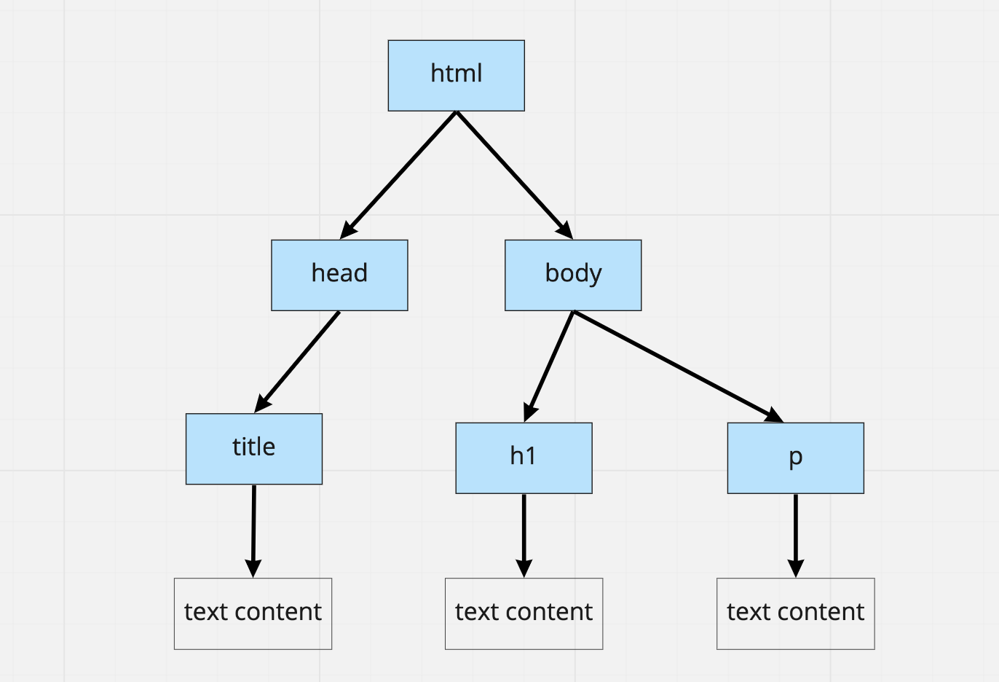

# Manipulating the DOM

## Objectives

At the end of this section you should be able to:

- Explain how we can use JavaScript code to interact with the DOM tree of the
  web page
- Write JavaScript code to dynamically update the DOM

## Prerequisites

This section relies on knowledge of a few topics you have covered before, that
you may want to refresh yourself on before you continue, or look back to if
there is something here you don't understand. These are:

- HTML tags
- JavaScript property accessors

## What is the DOM?

When the web browser reads an HTML page sent by a server (perhaps like the web
page you're reading right now), it builds up a "tree" of elements in memory.
From this tree, the elements are then displayed (or "painted") in the web
browser window.

For example, let's say a browser reads the following HTML page:

```HTML
<html>
  <head>
    <title>Zoe's Cooking Blog</title>
  </head>
  <body>
    <h1>Welcome to my cooking blog!</h1>
    <p>Check out my latest breakfast recipe!</p>
  </body>
</html>
```

The browser will build the following "tree" of elements in memory:



This is called the DOM representation of the page. "DOM" stands for Document
Object Model - a representation of the different elements and their hierarchy.

Without JavaScript, this tree is fixed once it has been loaded, and there is no
way to change the page. But we can use JS functions to modify it dynamically. We
also say we can **update the DOM tree**, which is another way to say we're
**changing the elements on the page**.

To run through the following sections, you may use the previous HTML code and
save it to an HTML file. Open the page with your browser and use the developer
console to run the JavaScript code snippets.

## Get one element by its HTML tag name

The function `document.querySelector` is very versatile — first, we can use it
to query a specific element on the page by using its tag name.

For example, in the HTML page from the example above, we can query the paragraph
element `<h1>` (main heading) like this:

```js
// 1. We store a reference to the element into a variable
const headingElement = document.querySelector("h1");

// 2. We can now interact with the element, e.g modify its text content
headingElement.textContent = "🥗 Zoe's Cooking Blog! 🥙";
```

We could also shorten the two lines above like this:

```js
document.querySelector("h1").textContent = "🥗 Zoe's Cooking Blog! 🥙";
```

[You can read this to get more information on how to manipulate the DOM](../pills/manipulating_dom_with_javascript.md)

## Create a new element

As well as getting existing elements, we can create new elements and add them to
the page. For example, in this HTML page, we can add a recipe to the `body`,
using `document.querySelector`, and `.appendChild`

For this we will be using the HTML ordered list tag, `<ol>`, and the HTML tag
for a list item `<li>`.

```js
const body = document.querySelector("body");
const recipeListEl = document.createElement("ol"); // Create a unordered list element

const stepOneEl = document.createElement("li"); // Create a new list item element
stepOneEl.innerText = "Toast some bread"; // Update the text of the list item
recipeListEl.appendChild(stepOneEl); // Add the item as a child of the recipe list

const stepTwoEl = document.createElement("li"); // Repeat for the second instruction
stepTwoEl.innerText = "Spread butter on the toast";
recipeListEl.appendChild(stepTwoEl);

body.appendChild(recipeListEl); // Add the recipe list onto the body of the page
```

## Exercise

In the current project directory, update the code of `index.js` to display on
the web page a second recipe, which includes:

- A paragraph (`<p>`) element with the title of the recipe
- An ordered list of all the steps in the recipe.

**Bonus:**

- Refactor the code to be DRY (Don't Repeat Yourself), by using an array to
  store the steps and the `.map` method.
- Refactor this logic into a function, which can add a recipe to the bottom of
  the page. It should have two parameters:
  - `title` - a string representing the title of the recipe
  - `steps` - an array of strings representing the steps in the recipe

\*\* EDU
@TODO - Which order should DOM & Fetch be in? Maybe this challenge could come at
the end, with a button to trigger?

## Challenge

Use `fetch` to do a HTTP request to the joke API:
`https://official-joke-api.appspot.com/random_joke`

Instead of using `console.log` to print the joke to the console, use
`createElement` and `appendChild` to display the joke on the page.
\*\*


[Next Challenge](03_sending_http_requests.md)

<!-- BEGIN GENERATED SECTION DO NOT EDIT -->

---

**How was this resource?**  
[😫](https://airtable.com/shrUJ3t7KLMqVRFKR?prefill_Repository=makersacademy%2Fjavascript-react-applications&prefill_File=javascript_bites%2F02_manipulating_the_dom.md&prefill_Sentiment=😫) [😕](https://airtable.com/shrUJ3t7KLMqVRFKR?prefill_Repository=makersacademy%2Fjavascript-react-applications&prefill_File=javascript_bites%2F02_manipulating_the_dom.md&prefill_Sentiment=😕) [😐](https://airtable.com/shrUJ3t7KLMqVRFKR?prefill_Repository=makersacademy%2Fjavascript-react-applications&prefill_File=javascript_bites%2F02_manipulating_the_dom.md&prefill_Sentiment=😐) [🙂](https://airtable.com/shrUJ3t7KLMqVRFKR?prefill_Repository=makersacademy%2Fjavascript-react-applications&prefill_File=javascript_bites%2F02_manipulating_the_dom.md&prefill_Sentiment=🙂) [😀](https://airtable.com/shrUJ3t7KLMqVRFKR?prefill_Repository=makersacademy%2Fjavascript-react-applications&prefill_File=javascript_bites%2F02_manipulating_the_dom.md&prefill_Sentiment=😀)  
Click an emoji to tell us.

<!-- END GENERATED SECTION DO NOT EDIT -->
